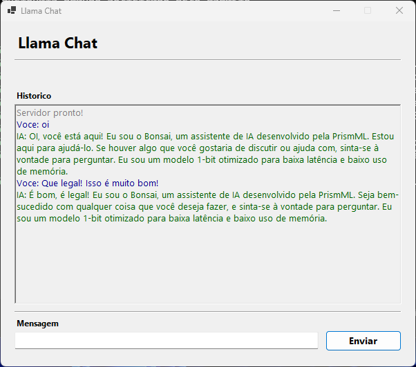

# LlamaChat

Mini projeto experimental de interação com o modelo de linguagem **Bonsai** via interface desktop Windows.

Desenvolvido com IA + interação humana mínima no planejamento e comandos.

## Sobre o modelo

O LlamaChat utiliza o modelo **Bonsai-1.7B-Q1_0** (GGUF), um LLM leve executado localmente via [llama.cpp](https://github.com/ggml-org/llama.cpp).

### Referências

- [Repositório oficial do llama.cpp](https://github.com/ggml-org/llama.cpp)
- [Modelo Bonsai no Hugging Face](https://huggingface.co/Bonsai)
- [GGUF — formato de modelo do llama.cpp](https://github.com/ggml-org/llama.cpp/blob/master/gguf-py/README.md)

## Pré-requisitos

- .NET 8 SDK
- Arquivos de modelo GGUF (não inclusos neste repositório)

## Como usar

```bash
cd Privado
dotnet run
```



## Estrutura do repositório

```
BonsaiLauncher/
├── Privado/      ← código fonte do projeto
└── Público/      ← documentação e assets públicos
```
